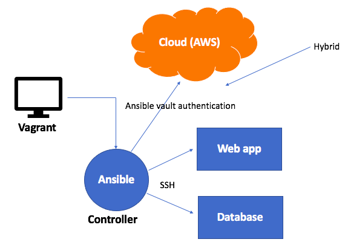

## What is it?
- It's a way of setting up your server infastructure using code instead of manual configuration.
- By using code you can automate the process.
- The nodes refer to the individual virtual machines that make up the infastructure.
-  Instead of manually setting up and configuring servers, networks, and other infrastructure components, IaC allows developers and system administrators to define and manage their infrastructure using code.

## How is it usually used?
- Ansible, Chef, and Puppet are commonly used for configuration. 
- Azure Resource Manager and Google Cloud Deployment Manager can be used as tools within the cloud.
- Terraform and CloudFormation are commonly used for terraform.

## What are the benefits?
- Scalability: Infastructure as code gives the ability to provision and configure infrastructure resources automatically and at a needed scale, reducing the time required for manual provisioning.
- Version control: Infrastructure code can be stored in version control systems, allowing teams to track changes, collaborate, and roll back to previous versions if needed.
- Reproducibility: Because we can use version control,infrastructure can be reliably reproduced across different environments, allowing for consistency and reducing the risk of manual errors.
- Rapid change: Changes to the infrastructure can be made programmatically, allowing for rapid and iterative development and deployment cycles.

## Ansible
### What is it?
Ansible is a popular open-source configuration management and automation tool that we can use for infastructure as code (IaC).

It provides a straightforward and efficient way to automate infrastructure management, making it easier to achieve consistency, scalability, and reproducibility across different environments.
### why do we use it?
- It is simple to use, and doesn't require a lot of code.
- It can run over 200 servers.
- Agentless = the agent nodes do not need Ansible installed. Ansible only needs to be on the controller node. It is no longer necessary to SSH into Agents, the Ansible Controller is where you do everything.