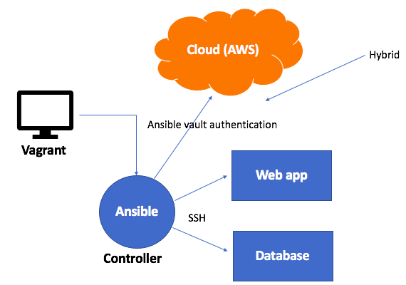
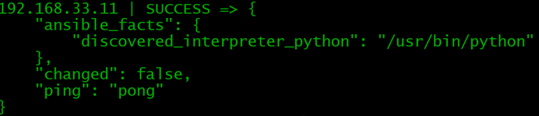
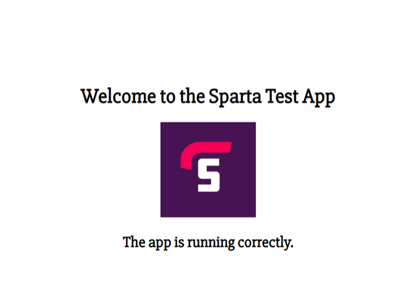

# Infastructure as code
## What is it?
- It's a way of setting up your server infastructure using code instead of manual configuration.
- By using code you can automate the process.
- The nodes refer to the individual virtual machines that make up the infastructure.
-  Instead of manually setting up and configuring servers and networks, IaC lets developers define/manage their infrastructure using code.

## How is it usually used?
- Ansible, Chef, and Puppet are commonly used for configuration. 
- Azure Resource Manager, AWS and Google Cloud Deployment Manager can be used as tools within the cloud.
- Terraform and CloudFormation are commonly used for terraform.

## What are the benefits?
- Scalability: Infastructure as code gives the ability to provision and configure infrastructure automatically and at a desired scale, reducing the time required for manual provisioning.
- Version control: Infrastructure code can be stored in version control systems, allowing teams to track changes, collaborate, and use previous versions if needed.
- Easy to reproduce: Because we can use version control,infrastructure can be consistently reproduced across multiple environments, allowing for more consistency and reducing the time it takes.
- Fast change: Changes to the infrastructure can be made through one controller, allowing for fast development.

## Ansible
### What is it?
Ansible is an open-source configuration management and automation tool that we can use for infastructure as code (IaC).

It provides a simple and efficient way to automate infrastructure management, making it easier to achieve consistency, scalability, and reproducibility across our network.
### why do we use it?
- It is simple to use, and doesn't require a lot of code.
- It can run thousands of servers at once.
- Agentless =  The virtual machines we access (aget nodes) don't need Ansible installed. Ansible only needs to be on the controller node. The Ansible Controller is where you are able to control everything.

# How to set up ping in ansible
We must first have vagrant open. In here, we add the vagrant file that we are using for Iac and `vagrant up`. After this, we `vagrant ssh controller, web and db` and do `sudo apt-get update` and `sudo apt-get upgrade` in each one. 
## Working in the terminal 
- We can first do `vagrant status`. We should see three VM running.
- We next do `vagrant ssh controller`
- To test that we are connected to the internet, we can do a `sudo apt-get update`.
- We can now enter the web VM with the command `ssh vagrant@192.168.33.10`. Note that this is the same result as doing `vagrant ssh web`.
- This will ask for a password when we do this.
- We can type `exit` and go into the DB VM with `ssh vagrant@192.168.33.11`.
- After we have been able to ssh in, we `exit` back into the controller.
- Here we enter the command `sudo apt install software-properties-common` to download common packages.
- We can now do the command `sudo apt-add-repository ppa:ansible/ansible`.
- To add, this we must then update. `sudo apt-get update -y`
- We now install ansible with `sudo apt install ansible -y`
- If we now do `sudo ansible --version`
- We can now cd into ansible with `cd /etc/ansible/`
- We now need to do `sudo nano hosts`
Under the section that says "# - A hostname/ip can be a member of multiple groups" with type below:

`[web]`

`192.168.33.10 ansible_connection=ssh ansible_ssh_user=vagrant ansible_ssh_pass=vagrant`
- If we do the command `sudo ansible web -m ping` we should get the message.

- Note: if this doesn't work, we can do `sudo nano ansible.cfg` and un-comment the `host_key_checking = False`. This however isn't usually recomended. 

## Adhoc commands
They allow you to run bash commands in ansible.


- Get OS of web host
`sudo ansible web -a "uname -a"`
- Get OS of db host
`sudo ansible db -a "uname -a"`
- Get date and time where the web host is
`sudo ansible web -a "date"`
- Get date and time where db host is
`sudo ansible db -a "date"`
- View the free and used memory of the web host
`sudo ansible web -a "free -m"`
- All files in theweb host
`sudo ansible web -a "ls -a"`


## Ansible playbook
Playbooks are written in YAML, and allow us to write a series of tasks tasks that we want our agent nodes to perform, allowing us to automate this.


- We create a playbook for the nginx:

`sudo nano nginx.yml`

In the playbook we then put:

```# add --- to start YAML file
---

# add the name of the host

- hosts: web

# Gain additional facts about the steps

  gather_facts: yes
# add admin access
  
  become: true

# install nginx

    tasks:
  
    - name: Installing Nginx 
      apt: pkg=nginx  state=present
```
## We run this playbook
- run playbook file with tasks written in yaml

`sudo ansible-playbook nginx.yml`

- check the status

`sudo ansible web -a "sudo systemctl status nginx"`

## Installing nodej
`sudo nano nodejs.yml`

```---
 hosts: web
  become: yes
  tasks:
     name: Add Node.js PPA
      shell: "curl -sL https://deb.nodesource.com/setup_12.x | sudo -E bash -"
      args:
        warn: no

     name: Install Node.js
      apt:
        name: nodejs
        update_cache: yes
        state: present
     name: Install npm
     apt:
       name: npm
       state: present
```


## Playbook for copying over the app folder, create playbook file:


`sudo nano copy_app_over.yml`

## Add the tasks
```
---
- hosts: web

# gather additional facts about the steps
 
  gather_facts: yes
# give admin access to this file
  
  become: true

# task: get app folder on web agent
  
  tasks:
  
  - name: Copy App folder
     
    copy:
      src: /etc/app/app
      dest: /home/vagrant/
```

- We can then run:

`sudo ansible-playbook nodejs.yml`

## Copying the app folder to the web VM

`sudo ansible web -m copy -a "src=/etc/app/app dest=/home/vagrant"`

`sudo ansible web -a "ls"`

## Start the app up

```
sudo nano app.yml
---
- hosts: web
  gather_facts: yes
  become: true

  tasks:  
    - name: Install Node.js
      become_user: vagrant
      shell: curl -sL https://deb.nodesource.com/setup_12.x | sudo -E bash -

    - name: Install nodejs package
      become_user: vagrant
      shell: sudo apt-get install -y nodejs

    - name: Install app dependencies
      become_user: vagrant
      shell: npm install
      args:
        chdir: /home/vagrant/app

    - name: Install PM2 globally
      shell: sudo npm install pm2 -g

    - name: Start the app with PM2
      shell: pm2 start app.js
      become_user: vagrant
      args:
        chdir: /home/vagrant/app
```
## We can now start the app
```
sudo ansible-playbook app.yml
```


## Setting up the db server
- We first need to make a playbook in the controller:
```
sudo nano setup_mongo.yml
```
- In here, we then add the following:
```
---
# Hosts name
- hosts: db

# Gather facts
  gather_facts: yes

# admin access
  become: true

# add instructions
  tasks:
  - name: setting up monodb
    apt: pkg=mongodb state=present
```

We then run this by:
```
sudo ansible-playbook mongo.yml
```
We can check the status by doing:
```
sudo ansible db -a "sudo systemctl status mongodb"
```
### Working in the db VM
- We navigate to the etc directory and do:
```
sudo nano mongodb.conf
```
- In here we need to change the bind ip to `0.0.0.0` and un-comment the port number. 
- We can now do:
```
sudo systemctl restart mongodb
sudo systemctl enable mongodb
sudo systemctl status mongodb
```
## Working in the app VM
- We need to edit the .bashrc file with:
```
sudo nano .bashrc
```
- At the bottom of this file, we then add:
``` 
export DB_HOST=mongodb://192.168.33.11:27017/posts
```
- We can then cd into the app and run:
```
npm start
```
## Putting mongodb into one playbook
```
---
# hosts name
- hosts: db
# get facts/logs
  gather_facts: yes
# admin access
  become: true
# add instructions:
# install mongodb
  tasks:
  - name: Set Up mongodb
    apt: pkg=mongodb state=present
# ensure db is running 
# replace the bind-ip to allow access from all ip addresses
  - name: Change bindIP to allow access
    replace:
      path: /etc/mongodb.conf
      regexp: 'bind_ip = 127.0.0.1'
      replace: 'bind_ip = 0.0.0.0'
# uncomment port = 27017
  - name: make sure that port 27017 is uncommented
    replace:
      path: /etc/mongodb.conf
      regexp: '#port = 27017'
      replace: 'port = 27017'
# restart mongodb with the changes made
  - name: Restart mongodb 
    systemd:
      name: mongodb
      state: restarted
# enables mongodb
  - name: Enable mongodb 
    systemd:
      name: mongodb
      enabled: yes
```
- This should automate the db database. 

# Terraform
Terraform is a method of IaC. It allows you to to define and manage your infastructure resources, like virtual machines, VPC's, storage, ...

## Launching an ec2 instance
- We must have our public and private access keys added so terraform can connect to AWS.
- We can then create a file to run our code in:
``` 
# To create a service on AWS cloud
# launch an ec2 in Ireland
# terraform to download required packages
# terraform init

provider "aws" {
# Which region of aws
        region = "eu-west-1"

}
# Git bash must have admin access
# Launch an ec2

# Which resource -
resource "aws_instance" "app_instance"{

# which AMI - ununtu 18.04
ami = "Insert the ami we want to use"
# type of instance - t2.micro
instance_type="t2.micro"
# do you need public ip = yes
associate_public_ip_address = true
# what should we call it
tags = {
        Name = "Insert instance name"
       }

}
```
- Note: The indentation matters
- We then can run the code
```
terraform init
terraform plan
terraform apply
terraform destroy
```
## Create a vpc

provider "aws" {    
    region = "eu-west-1"

}
resource "aws_vpc" "my_vpc"{
        cidr_block = "10.0.0.0/16"

tags = {
        Name = "tech-230-jamie-vpc-terraform"}
}

resource "aws_subnet" "my_subnet" {
        vpc_id = aws_vpc.my_vpc.id
        cidr_block = "10.0.2.0/24"
        availability_zone = "eu-west-1a"
        tags = {
                Name = "tech230-jamie-subnet-terraform"
}
}
resource "aws_subnet" "private_subnet" {
    vpc_id = aws_vpc.my_vpc.id
    cidr_block = "10.0.3.0/24"
    availability_zone = "eu-west-1b"tags = {
        Name = "tech230-jamie-private-subnet-terraform"
    }
}
resource "aws_vpc_attachment" "my_attachment" {
    vpc_id = aws_vpc.my_vpc.id
    internet_gateway_id = aws_internet_gateway.my_igw.id
}

resource "aws_route_table" "public_route_table" {
    vpc_id = aws_vpc.my_vpc.id
    tags = {
        Name = "tech230-jamie-route-table-terraform"
    }
}

resource "aws_route" "public_route" {
    route_table_id = aws_route_table.public_route_table.id 
    destination_cidr_block = "0.0.0.0/0"
    gateway_id= aws_internet_gateway.my_igw.id
}

resource "aws_route_table_association" "public_association" {
    subnet_id= aws_subnet.public_subnet.id
    route_table_id = aws_route_table.public_route_table.id
}